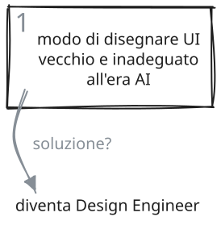
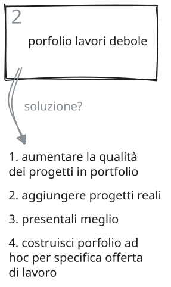
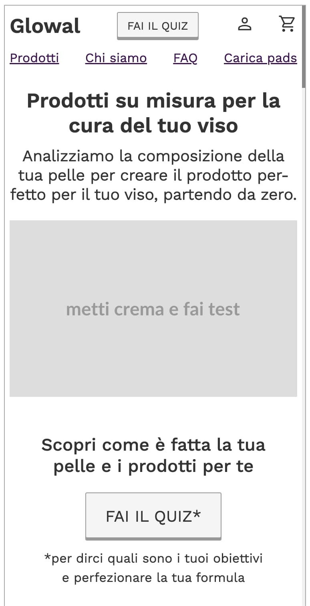
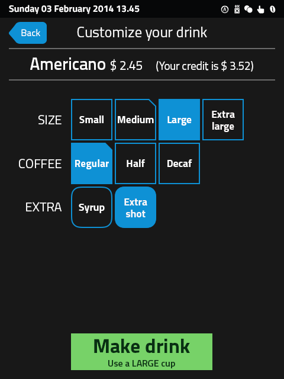
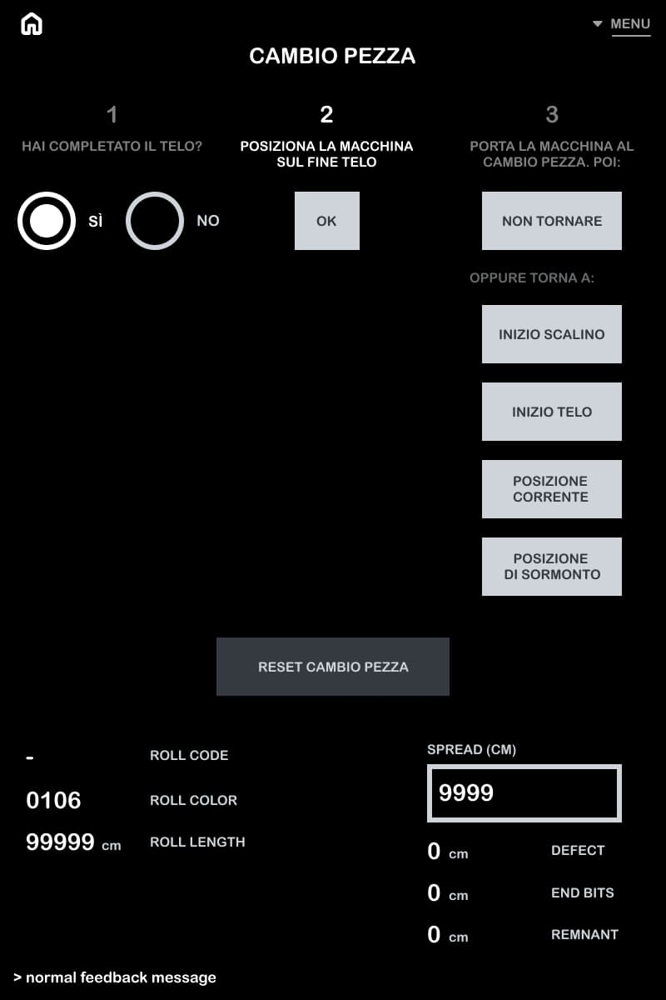

# Componenti

Documentazione dei componenti riusabili (`.c-<nome>`). Convenzioni generali in `design-system.md`.

## Button (`.c-button`)

**Scopo**: azione primaria cliccabile (CTA, submit).

**Dove usato**: sezione "Mini corso gratis" (`content.html`).

**File**: `css/components/button.css`

**Markup**:

```html
<button type="button" class="c-button">Iscriviti ora</button>
```

Anche su `<a>` quando l'azione è una navigazione, non un submit:

```html
<a href="#" class="c-button">Iscriviti ora</a>
```

**Variabili (interfaccia)**:

- `--button-bg` — default `var(--celadon)`
- `--button-fg` — default `var(--color-on-primary)` (zinc-900, contrasto ~10.7:1 su celadon)

Override per istanza, es. bottone secondario:

```html
<button type="button" class="c-button" style="--button-bg: var(--color-secondary); --button-fg: var(--color-on-secondary)">Scopri di più</button>
```

**Stati**:

- `:hover` — `filter: brightness(0.93)`
- `:active` — `filter: brightness(0.87)`
- `:disabled` — `opacity: var(--opacity-disabled)`, `cursor: not-allowed`
- `:focus-visible` — ereditato dalla regola globale (`--focus-ring-color`), nessuno stile aggiuntivo

**Stile**: minimalista — nessuna ombra, nessun bordo, un solo livello di elevazione (colore pieno), radius `--radius-8`.

## Accordion (`.c-accordion`)

**Scopo**: contenuto collassabile, mostra/nasconde la risposta a una domanda (FAQ).

**Dove usato**: sotto-sezione "FAQ" dentro "Il problema del Junior Designer da quando c'è AI" (`content.html`).

**File**: `css/components/accordion.css`

**Markup**: elementi nativi `<details>`/`<summary>` — niente JS, toggle e stato aperto/chiuso gestiti dal browser.

```html
<details class="c-accordion">
  <summary>Domanda?</summary>
  <ul>
    <li>Risposta, punto 1.</li>
    <li>Risposta, punto 2.</li>
  </ul>
</details>
```

**Variabili (interfaccia)**: nessuna esposta per ora — non ce n'è ancora bisogno con un solo caso d'uso.

**Stati**:

- **Chiuso** (default): icona `+` a destra della domanda.
- **Aperto** (`[open]`, attributo nativo di `<details>`): icona diventa `×`, contenuto visibile.
- `:focus-visible` sul `<summary>` — ereditato dalla regola globale.

**Accessibilità**: `<details>`/`<summary>` è un disclosure widget nativo — operabile da tastiera (Invio/Spazio su `<summary>` focus) e stato espanso/collassato annunciato automaticamente dagli screen reader, senza bisogno di `aria-expanded` gestito a mano.

**Stile**: minimalista — nessuna animazione di apertura (native, istantanea), un solo bordo inferiore per separare le voci, icona come unico indicatore di stato.

**Nota**: `git`/`GitHub` corretti da refusi ("gihub", minuscolo) durante la trascrizione da `content.md`; "Il Designer Engineer" corretto in "Il Design Engineer" (refuso, incoerente col resto del documento); "mockups" adattato in "mockup" (uso italiano, plurale invariato).

## Step cards (`.c-step-cards` / `.c-step-card`)

**Scopo**: sequenza di 2+ step numerati, con freccia di collegamento tra un box e il successivo. Basato su uno sketch fornito dall'utente.

**Dove usato**: sotto-sezione "Le soluzioni che offre questo corso" dentro "Il problema del Junior Designer da quando c'è AI" (`content.html`), al posto del paragrafo prosa "Diventa Design Engineer sono le fondamenta...".

**File**: `css/components/step-cards.css`

**Markup** (variante `sketch`, attuale in produzione):

```html
<div class="c-step-cards">
  <div class="c-step-card" data-variant="sketch">
    
    <audio class="c-step-card__audio" controls src="assets/audio/step-card-audio-1.m4a"></audio>
  </div>
  <span class="c-step-cards__arrow" aria-hidden="true">➡️</span>
  <div class="c-step-card" data-variant="sketch">
    
    <audio class="c-step-card__audio" controls src="assets/audio/step-card-audio-2.m4a"></audio>
  </div>
</div>
```

Markup delle altre varianti (`corner`/`bar`/`badge`/`outline`/`ghost`, con `.c-step-card__number`/`<p>` invece della SVG): vedi `componenti.html#step-card`.

**Variabili (interfaccia)**: `--step-card-bg`, più per variante (vedi sotto) `--step-card-number-bg`, `--step-card-number-fg`, `--step-card-border`.

**Responsive**: mobile-first.

- Sotto 768px: box impilati in colonna, frecce nascoste (`display: none`).
- Da 768px: box in riga (`flex-direction: row`), frecce visibili.

**Varianti estetiche** (`data-variant`, stessa markup, regole CSS diverse per il numero — vedi `design-system.md`): galleria completa e sempre aggiornata in `componenti.html#step-card`.

- *"corner"* (default, nessun attributo): sfondo `--zinc-100`, numero in alto a destra, testo muted.
- `data-variant="bar"` — barra scura a piena larghezza in alto, numero centrato dentro (sketch utente).
- `data-variant="badge"` — pallino scuro che sborda dall'angolo in alto a destra (sketch utente).
- `data-variant="outline"` — nessun riempimento, bordo, numero a sinistra in `--color-primary`.
- `data-variant="ghost"` — **precedente in produzione**, mantenuta come riferimento (non cancellata, stesso principio dei branch scartati): numero enorme e tenue come sfondo decorativo, testo sopra.
- `data-variant="sketch"` — **attuale in produzione**, markup diverso dalle altre varianti (eccezione al "stessa markup" generale): nessun `.c-step-card__number`/`<p>`, solo un ``. La SVG (sketch fornito dall'utente, disegnato in Excalidraw) contiene già numero, illustrazione e testo — sostituisce del tutto il contenuto della card, il `<div class="c-step-card">` resta solo un contenitore di layout (`background: none; padding: 0`). Una SVG dedicata per step: `assets/images/step-card-sketch-1.svg`/`-2.svg`/`-3.svg` — l'`alt` di ogni `` porta comunque la label testuale dello step, come alternativa accessibile al testo scritto a mano dentro la SVG.

**Audio per step (`.c-step-card__audio`)**: elemento aggiuntivo dentro `.c-step-card` (variante `sketch`), sotto la SVG — `<audio class="c-step-card__audio" controls src="...">`. Controlli nativi del browser, nessun player custom (coerente con "nessun framework/build step"). Presente su tutti e 3 gli step (`assets/audio/step-card-audio-1.m4a`/`-2.m4a`/`-3.m4a`) — resta comunque un elemento opzionale del pattern, non obbligatorio per ogni card futura.

**Stile**: minimalista — nessun bordo nel default, radius `--radius-12`. Freccia: emoji `➡️`, marcata `aria-hidden="true"` perché puramente decorativa (l'ordine è già chiaro dai numeri e dall'ordine del DOM).

## Masonry (`.c-masonry`)

**Scopo**: griglia di immagini a colonne (effetto "masonry"), altezze diverse impaginate senza buchi vistosi.

**Dove usato**: `componenti.html` (galleria vecchia). Non più in `portfolio.html`, che dal 12 settembre 2026 usa `.c-project` + `.c-filmstrip`.

**File**: `css/components/masonry.css`

**Markup**: il contenitore `.c-masonry` viene popolato via JS a runtime (fetch di `assets/portfolio/manifest.json`), non staticamente — 56 immagini, troppe da scrivere a mano nell'HTML.

```html
<div class="c-masonry">
  
  <!-- ... -->
</div>
```

**Variabili (interfaccia)**: nessuna per ora.

**Responsive**: mobile-first.

- Sotto 768px: `column-count: 1`.
- Da 768px: `column-count: 3`.

**Nota tecnica**: implementato con CSS multi-column (`column-count`/`break-inside: avoid`), non con `grid-template-rows: masonry` — quest'ultimo non ha supporto affidabile nei browser stabili. È un'approssimazione a colonne (ogni immagine scorre nella colonna più corta), non una vera masonry riga per riga, ma è l'approccio standard senza JS di impaginazione dedicato.

**`loading="lazy"`**: nativo, nessuna libreria — utile con 56 immagini nella stessa pagina.

### Overlay di ingrandimento (`.c-masonry-overlay`)

**Scopo**: click/tap su uno screenshot lo mostra ingrandito. Scoped alla colonna contenuto (non copre la sidebar), non full-viewport — scelta esplicita dopo un confronto tra pattern.

**Markup**: dentro `.c-masonry-container`, accanto a `.c-masonry`.

```html
<div class="c-masonry-container">
  <div class="c-masonry">...</div>
  <div class="c-masonry-overlay" hidden>
    <button type="button" class="c-masonry-overlay__close" aria-label="Chiudi">×</button>
    
  </div>
</div>
```

**Comportamento** (JS in `portfolio.html`, nessuna libreria):

- Click su un'immagine della griglia → apre l'overlay con quell'immagine (`object-fit: contain`, ingrandita al massimo dentro la colonna contenuto).
- Click ovunque nell'overlay, tasto Esc, o bottone "×" → chiude.
- Nessuna navigazione prev/next per ora (prototipo — vedi `journal.md`).

**Nota tecnica importante**: `position: fixed` verticalmente + `left`/`width` calcolati via JS (`getBoundingClientRect()` del contenitore) ad ogni apertura e su resize. Necessario perché il contenitore (`.c-masonry-container`) è alto quanto tutta la griglia (molto più del viewport) — un overlay `position: absolute; inset: 0` centrerebbe l'immagine a metà di quell'altezza, spesso fuori dallo scroll corrente. Dettagli in `design-system.md`, sezione Z-index.

**Stati**: nessuno stato hover/focus particolare oltre al default globale. Il bottone "×" è raggiungibile da tastiera; Esc chiude.

## Avatar (`.c-avatar`)

**Scopo**: foto profilo/persona, ritagliata a cerchio.

**Dove usato**: sezione "Ciao, mi chiamo Luca Leone" — inline con float a inizio paragrafo. (Provata anche in sidebar sotto il link "Come insegno?", scartata dopo confronto diretto.)

**File**: `css/components/avatar.css`

**Markup**: uso inline con testo che avvolge (float) — stile posizionale via `style` inline sull'istanza, non fa parte dell'identità del componente, è specifico del contesto:

```html

```

**Variabili (interfaccia)**: nessuna per ora — dimensione fissa (`--space-120`), da esporre come variabile se serve una dimensione diversa altrove.

**Stile**: `object-fit: cover` (ritaglio pulito indipendentemente dal rapporto d'aspetto originale), `border-radius: var(--radius-full)` (cerchio).

**Nota**: in `assets/images/` esistono già altre foto persona (autori delle testimonianze — Andrea De Nuccio, Davide Cester, Stefano Falvella, ecc.), probabile riuso di questo componente quando quelle sezioni verranno completate con foto invece che solo testo.

## Video facade (`.c-video`)

**Scopo**: embed video (Vimeo) con caricamento lazy — mostra solo una thumbnail + icona play finché l'utente non clicca. Al click, il video si ingrandisce in overlay fino a coprire l'intera colonna contenuto (non tutto il viewport, non la sidebar).

**Dove usato**: inline nel primo `<li>` di "Come insegno?" dentro "Ciao, mi chiamo Luca Leone" (`content.html`), come thumbnail piccola con float.

**File**: `css/components/video.css` + `js/video-facade.js` (nessuna libreria).

**Markup** (thumbnail piccola, float — dimensione/posizione via `style` inline sull'istanza, non fa parte dell'identità del componente):

```html
<li style="display: flow-root">
  <figure class="c-video" style="float: left; width: var(--space-216); margin-right: var(--space-18); margin-bottom: var(--space-12)">
    <div class="c-video__box">
      <div class="c-video__facade" data-src="https://player.vimeo.com/video/ID?autoplay=1">
        
        <svg class="c-video__play" ...>...</svg>
      </div>
    </div>
    <figcaption>Testo della didascalia.</figcaption>
  </figure>
  <strong>Testo del bullet</strong>: resto del testo che avvolge la thumbnail.
</li>
```

**Nota strutturale — due bug reali trovati e corretti durante il test** (dettagli in `journal.md`):

1. Il box con `aspect-ratio`/`overflow: hidden` è `.c-video__box`, un `<div>` interno — **non** la `<figure>` stessa. Se fosse sulla `<figure>`, la `<figcaption>` (figlio normale, non posizionato) finirebbe schiacciata nella stessa box e nascosta dietro al facade (`position: absolute`), invisibile.
2. Il `<li>` che contiene la figure floatata ha bisogno di `display: flow-root` — senza, il float non resta contenuto nel suo `<li>` e "sfonda" visivamente sovrapponendosi ai bullet successivi della lista.

**Comportamento**: click su `.c-video__facade` → JS crea (una volta sola, per facade) un overlay `position: fixed`, con `left`/`width` calcolati via `getBoundingClientRect()` del `.l-section__content` più vicino, e ci inietta un `<iframe>` con `src` da `data-src`. Nessuna richiesta di rete al provider finché l'utente non clicca. Chiusura: click sul backdrop, bottone "×", o Esc — la thumbnail torna al suo stato piccolo iniziale (l'iframe viene distrutto, non solo nascosto). Stesso pattern scoped-al-contenitore già usato per `.c-masonry-overlay` in `portfolio.html`.

**Variabili (interfaccia)**: nessuna per ora — `aspect-ratio: 16 / 9` fisso sia per la thumbnail che per l'overlay ingrandito.

**Accessibilità**: `alt=""` sulla thumbnail (decorativa, la `figcaption` già descrive il contenuto — evita doppio annuncio agli screen reader). La `figcaption` non è duplicata nell'overlay ingrandito (scompare insieme alla thumbnail piccola, per scelta esplicita).

**Stato di caricamento nell'overlay**: al click, prima di creare l'iframe, JS clona la thumbnail del facade e aggiunge uno spinner (`.c-video-overlay__thumbnail` + `.c-video-overlay__spinner`) dentro `.c-video-overlay__box`. L'iframe parte a `opacity: 0`; al suo evento `load` riceve la classe `.is-loaded` (fade a `opacity: 1`, `--duration-250`) e lo spinner viene rimosso. Evita il "buco vuoto" percepito tra apertura overlay e comparsa effettiva del video — vedi `journal.md` (2026-07-30). Completato con `<link rel="preconnect">` verso i domini Vimeo in `content.html` (connessione di rete anticipata, indipendente dal componente in sé).

## FAQ container (`.c-faq`)

**Scopo**: dare identità visiva/contenimento a un blocco titolo+accordion (sfondo leggero, angoli arrotondati, padding) — prima h3 e `.c-accordion` non erano wrappati in nulla, vivevano nudi nel flusso della colonna.

**Dove usato**: blocco FAQ dentro "Il problema del Junior Designer da quando c'è AI" (`content.html`), wrappa `<h3 id="faq-problema">` + `<details class="c-accordion">`.

**File**: `css/components/faq.css`.

**Markup**:

```html
<div class="c-faq">
  <h3 id="faq-problema">FAQ</h3>
  <details class="c-accordion">...</details>
</div>
```

**Stile**: `background: var(--zinc-100)`, `border-radius: var(--radius-8)`, `padding: var(--space-24)`. Nessuna variabile d'interfaccia per ora — prima versione esplicitamente "per iniziare", da iterare.

**Nota**: l'h3 come primo figlio del box non ha bisogno di reset aggiuntivo — la regola globale `h3:first-child { margin-top: 0 }` (`base.css`) si applica già. Non ancora riusato altrove: se un secondo caso d'uso emerge (es. altre FAQ nella pagina), valutare se generalizzare il nome o tenerlo specifico.

## Schedule (`.c-schedule`)

**Scopo**: elenco di appuntamenti — data a sinistra, titolo e una riga di descrizione a destra. Nessuna interazione.

**Dove**: sezione "Pre-corso gratuito" di `index.html`, le 4 live.

**Markup**:

```html
<ol class="c-schedule">
  <li class="c-schedule__item">
    <div class="c-schedule__date">14 ott <small>mercoledì, 19:00</small></div>
    <div>
      <p class="c-schedule__title">Titolo della live</p>
      <p>Una riga di descrizione.</p>
    </div>
  </li>
</ol>
```

**Variabili esposte**: nessuna per ora — consuma `--color-border`, `--color-text-muted` e la scala `--space-*`. La colonna data è fissa a `--space-108`.

**Stati**: nessuno.

**Nota tema**: `css/theme-brand.css` mette la data in `--font-display`; il componente di per sé usa solo il peso (`--font-weight-700`), così resta neutro rispetto al tema.

## Filmstrip (`.c-filmstrip`)

**Scopo**: immagini con proporzioni diverse (9:16, 4:3, 16:9) tutte alla stessa altezza, in fila. Se non stanno, scorrono in orizzontale dentro il contenitore, mai la pagina. Nessun ingrandimento al click.

**Dove**: gallery dei progetti in `portfolio.html`.

**Markup**:

```html
<div class="c-filmstrip">
  
  
</div>
```

**Variabili esposte**: `--filmstrip-height` (default `--space-240`, `--space-300` da 768px).

**Stati**: nessuno. `scroll-snap-type: x mandatory` per lo scroll a scatti.

## Project (`.c-project`)

**Scopo**: un progetto del portfolio — titolo, riga meta, filmstrip, template a etichette fisse, link. Le etichette sono sempre le stesse cinque (`Product · Complexity · Immersion · Made obvious · Result`): il ritmo ripetuto è parte del design della pagina.

**Dove**: `portfolio.html`, uno per progetto, dentro la `<section>` del cluster.

**Markup**: vedi il primo `<article class="c-project">` in `portfolio.html`. Sul branch `feature/portfolio-themes` l'article ha `data-tags="hmi"` (più tag separati da spazio) e una riga `.c-project__tags` sotto il meta con i tag come link `?tag=…`. `<dl>` per il template (etichetta = `<dt>`, testo = `<dd>`): da 768px griglia a due colonne (`--space-144` + 1fr), sotto etichetta sopra testo. Una riga del template può essere omessa (es. `Result` se non c'è nulla di onesto da dire), mai riempita.

**Variabili esposte**: nessuna.

**Stati**: nessuno.

## Cluster nav (`.c-cluster-nav`)

**Scopo**: indice orizzontale di anchor alle sezioni della pagina. Non sticky, nessuno stato attivo, zero JS.

**Dove**: `portfolio.html`, sotto l'intestazione.

**Markup**:

```html
<nav aria-label="Work by type">
  <ul class="c-cluster-nav">
    <li><a href="#hmi">HMI &amp; embedded</a></li>
  </ul>
</nav>
```

**Variabili esposte**: nessuna. **Stati**: nessuno.

## Tag filter (`.c-tag-filter`) — branch `feature/portfolio-themes`

**Scopo**: filtra i progetti per tipo di lavoro. Le sezioni della pagina sono le 4 tesi ("I simplify complex software"…), i tag sono i tipi (HMI, ecommerce…). Un tag attivo nasconde i progetti senza quel tag e le sezioni rimaste vuote.

**Dove**: `portfolio.html`, sotto l'intestazione.

**Markup**:

```html
<nav aria-label="Filter by type of work">
  <ul class="c-tag-filter">
    <li><a href="?" aria-pressed="true">All</a></li>
    <li><a href="?tag=hmi" aria-pressed="false">HMI &amp; embedded</a></li>
  </ul>
  <p class="c-tag-filter__empty" hidden>No projects with this tag yet.</p>
</nav>
```

**Comportamento** (`js/portfolio-filter.js`): progressive enhancement. Senza JS i link ricaricano la pagina con `?tag=…`; lo script legge il parametro al caricamento e applica il filtro, e intercetta i click solo per evitare il reload (`history.replaceState`). Funziona anche dai link `.c-project__tags` dentro i progetti. URL linkabile: `portfolio.html?tag=hmi#simplify`.

**Stati**: `[aria-pressed="true"]` → sottolineatura in `--color-accent`, unico accento della pagina.

